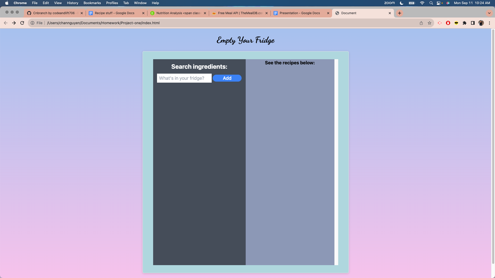
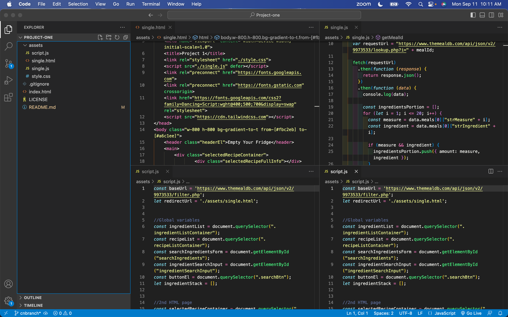

# Empty Your Fridge

Empty Your Fridge was written by MJ, Chan Nguyen, Brian Lee, and Kyle Oros. It utilizes the MealDB API in regards to the recipes and their respective profiles, and the Edamam Nutritional Data API to calculate the nutritional data on the ingredients found in MealDB.  

## DESCRIPTION
Empty Your Fridge is a web application that prompts the user to enter ingredients the wish to utilize in a recipe. Upon receiving the user's inputs, EYF will cross-compare their ingredient entries to a database, and return recipes to the user that match their parameters. Upon clicking any of these recipes, the user will be taken to a separate page containing the cooking instructions and nutritional data on the ingredients used. The deployed application can be found here: https://MJ-AZN.github.io/Project-one/. The GitHub link can be found here: https://github.com/MJ-AZN/Project-one.

## TECHNOLOGIES USED
We used Figma & GoogleSlides to put together the wireframe, to put our ideas we brainstormed into a tangible blueprint. We used Tailwind as our CSS framework. We use Github for version control, collaboration, for working on pieces of code separately, to come altogether. We used VS Code for all of our code for HTML, CSS, JavaScript.
The first API we used is TheMealDB, which contains the array of recipes that our application cross-examines for upon being given the user’s choice of ingredients. For our second API, we used Edamam, which generates the nutritional data of the recipe based on the ingredients.

## VISUALS
View a screenshot of the application here:

View a screenshot of the VS Code here:

## CREDITS
Empty Your Fridge was written by MJ, Chan Nguyen, Brian Lee, and Kyle Oros. It utilizes the TheMealDB API in regards to the recipes and their respective profiles, and the Edamam Nutritional Data API to calculate the nutritional data on the ingredients found in TheMealDB.
TheMealDB: https://www.themealdb.com/api.php.
Edamam: https://developer.edamam.com/edamam-docs-nutrition-api.
Tailwind: https://tailwindcss.com/.
The coding (variables, conditional statements, console logs, jquery specific formulas, functions) -all the additions- that were made to the web page are credited to the curriculum taught in the UCI coding boot camp.
Resource used for fetch API - POST: https://www.topcoder.com/thrive/articles/fetch-api-javascript-how-to-make-get-and-post-requests.
Resource used to remove from array: https://stackoverflow.com/questions/5767325/how-can-i-remove-a-specific-item-from-an-array-in-javascript.
Resource used for JSON parse: https://developer.mozilla.org/en-US/docs/Web/JavaScript/Reference/Global_Objects/JSON/parse.
Resource used for localstorage get item: https://www.w3schools.com/jsref/met_storage_getitem.asp.
